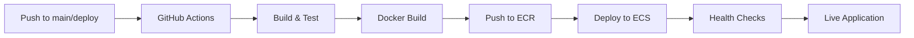

# Vendorify - Next.js Full-Stack Application

This is a [Next.js](https://nextjs.org) project bootstrapped with [`create-next-app`](https://nextjs.org/docs/app/api-reference/cli/create-next-app) and deployed to **AWS ECS with automated CI/CD**.

## 🚀 **Production Deployment**

**Live Application:** Deployed on AWS ECS Fargate with automated CI/CD pipeline

### **Infrastructure Stack**
- **Platform:** AWS ECS (Elastic Container Service) 
- **Compute:** Fargate (serverless containers)
- **Registry:** Amazon ECR (Elastic Container Registry)
- **CI/CD:** GitHub Actions
- **Scaling:** Auto-scaling with load balancing capability

### **Deployment Pipeline**


**Automated on every push to `main` or `deploy` branches:**
1. ✅ **Build & Test** - Lint code and build application
2. ✅ **Containerize** - Create optimized Docker image  
3. ✅ **Deploy** - Push to ECR and update ECS service
4. ✅ **Monitor** - Health checks ensure successful deployment

---

## 🛠 **Local Development**

### **Prerequisites**
- Node.js 20+
- pnpm (recommended) or npm

### **Getting Started**

First, run the development server:

```bash
# Install dependencies
pnpm install

# Start development server
pnpm dev
# or
npm run dev
```

Open [http://localhost:3000](http://localhost:3000) with your browser to see the result.

You can start editing the page by modifying `app/page.tsx`. The page auto-updates as you edit the file.

### **Available Scripts**
```bash
pnpm dev          # Development server
pnpm build        # Production build
pnpm start        # Start production server
pnpm lint         # Run ESLint
pnpm build:staging    # Build with staging environment
pnpm build:production # Build with production environment
```

---

## 📊 **2.3 Advanced Data Fetching and Rendering Strategies**

This project demonstrates three core rendering strategies in Next.js 14+ using the App Router, optimized for production deployment.

### **Architecture Overview**

| Page      | Route        | Strategy | Config                      | Use Case           | Deployment Impact |
| --------- | ------------ | -------- | --------------------------- | ------------------ | ----------------- |
| About     | `/about`     | **SSG**  | `revalidate = false`        | Static content     | Pre-built in Docker |
| Dashboard | `/dashboard` | **SSR**  | `dynamic = 'force-dynamic'` | Real-time data     | Server-side in ECS |
| Vendors   | `/vendors`   | **ISR**  | `revalidate = 60`           | Occasional updates | Cached in ECS |

### 1. Static Rendering (SSG) - `/about`

**What:** Page is pre-built at deployment and served identically to all users.

**Why chosen for Vendorify:** The About page contains company info that rarely changes. SSG provides:

- Instant load times (no server computation)
- Zero server load per request
- Maximum CDN efficiency

**When data is fetched:** At build time (`next build`), before deployment.

### 2. Dynamic Rendering (SSR) - `/dashboard`

**What:** Page is rendered fresh on every request with real-time data.

**Why chosen for Vendorify:** The Dashboard shows user-specific, time-sensitive data. SSR ensures:

- Every user sees current data
- No stale information
- Personalization is possible

**When data is fetched:** On every request (server-side).

**Trade-off:** Slightly slower response time, but guaranteed freshness.

### 3. Hybrid Rendering (ISR) - `/vendors`

**What:** Page is cached and served instantly, but re-rendered in the background every N seconds.

**Why chosen for Vendorify:** The Vendor list updates occasionally but doesn't need real-time accuracy. ISR provides:

- Fast cached responses (like SSG)
- Automatic background updates (like SSR)
- Best of both worlds

**When data is fetched:**

- First request: at build time
- Subsequent: from cache
- Every 60s: background revalidation

### How Caching/Revalidation Improves Performance

| Strategy | Server Load             | Response Time | Data Freshness  |
| -------- | ----------------------- | ------------- | --------------- |
| SSG      | ~0                      | <10ms         | Build time only |
| SSR      | High (1 req = 1 render) | 50-200ms      | Always fresh    |
| ISR      | Low (1 render/60s)      | <10ms         | 60s stale max   |

### Scaling to 10x More Users

**SSR (Dashboard):**

- 10,000 users = 10,000 server renders/second
- Would need horizontal scaling, load balancing
- Database connection pooling required
- Consider moving non-critical data to ISR

**ISR (Vendors):**

- Still only ~1 render per 60 seconds
- 99.98% reduction in server load vs SSR
- Cache layer handles traffic spikes
- Ideal for scaling

**SSG (About):**

- No change needed—static files scale infinitely
- CDN handles all traffic

### **Testing the Pages**

```bash
# Local development
pnpm dev
```

Then visit:
- http://localhost:3000/about (SSG)
- http://localhost:3000/dashboard (SSR - refresh to see time change)
- http://localhost:3000/vendors (ISR)

---

## 🐳 **Docker & Containerization**

### **Multi-Stage Docker Build**
The application uses an optimized multi-stage Docker build:

```dockerfile
# Development dependencies → Production build → Runtime image
Node.js 20 Alpine → Next.js standalone → Minimal production container
```

**Features:**
- ✅ Multi-stage build for minimal image size
- ✅ Non-root user for security
- ✅ Health checks with curl
- ✅ Optimized for Next.js standalone output
- ✅ Production-ready configuration

### **Local Docker Testing**
```bash
# Build the image
docker build -t vendorify-app .

# Run locally
docker run -p 3000:3000 vendorify-app
```

---

## ☁️ **AWS Infrastructure**

### **ECS Configuration**
- **Cluster:** `vendorify-cluster`
- **Service:** `vendorify-service` 
- **Task Definition:** `vendorify-task`
- **Resources:** 0.5 vCPU, 1GB Memory
- **Network:** VPC with Fargate launch type

### **Container Specifications**
- **Image:** `612812184105.dkr.ecr.us-east-1.amazonaws.com/vendorify-app:latest`
- **Port:** 3000 (HTTP)
- **Health Check:** HTTP endpoint monitoring
- **Logging:** CloudWatch Logs (`/ecs/vendorify-app`)
- **Environment:** Production configuration with NODE_ENV=production

### **CI/CD Pipeline**
**GitHub Actions workflow** (`.github/workflows/deploy.yml`):

**Triggers:** Push to `main` or `deploy` branches

**Steps:**
1. **Build & Test**
   - Install dependencies with pnpm
   - Run ESLint for code quality
   - Build Next.js application

2. **Deploy** (production branches only)
   - Configure AWS credentials
   - Login to Amazon ECR
   - Build and tag Docker image
   - Push to ECR registry
   - Update ECS task definition
   - Deploy new service revision
   - Wait for service stability

### **Required GitHub Secrets**
```bash
AWS_ACCESS_KEY_ID=your-aws-access-key
AWS_SECRET_ACCESS_KEY=your-aws-secret-key
```

---

## 🔧 **Environment-Aware Builds & Secrets Management**

This project supports per-environment configuration files and safe secret injection at build/runtime.

### **Environment Files**
The following files are included with placeholder values only:
- `.env.development` - Local development variables
- `.env.staging` - Staging environment configuration  
- `.env.production` - Production environment configuration
- `.env.example` - Template of required variables

### **Build Commands**
```bash
pnpm build:staging     # Build with staging config
pnpm build:production  # Build with production config
```

### **Secrets Management in Production**
**🚨 No secrets committed to Git** - Real secrets are injected via:

**AWS Production:**
- **GitHub Actions:** Repository secrets for CI/CD
- **AWS Parameter Store:** Runtime secrets via ECS task definition
- **Environment Variables:** Injected at container startup

**Security Best Practices:**
- ✅ Secrets stored in AWS Parameter Store/Secrets Manager
- ✅ IAM roles for service-to-service authentication  
- ✅ No hardcoded credentials in code or Docker images
- ✅ Least-privilege access patterns

---

## 📚 **Learn More**

### **Next.js Resources**
- [Next.js Documentation](https://nextjs.org/docs) - learn about Next.js features and API.
- [Learn Next.js](https://nextjs.org/learn) - an interactive Next.js tutorial.
- [Next.js GitHub repository](https://github.com/vercel/next.js) - feedback and contributions welcome!

### **AWS Resources**
- [ECS Documentation](https://docs.aws.amazon.com/ecs/) - container orchestration
- [Fargate Guide](https://docs.aws.amazon.com/AmazonECS/latest/userguide/what-is-fargate.html) - serverless containers
- [ECR Documentation](https://docs.aws.amazon.com/ecr/) - container registry

### **DevOps Resources**
- [GitHub Actions](https://docs.github.com/en/actions) - CI/CD automation
- [Docker Best Practices](https://docs.docker.com/develop/dev-best-practices/) - containerization guides

---

## 🚀 **Deployment Status**

**Current Environment:** Production  
**Last Deployed:** Automatic via GitHub Actions  
**Health Status:** Monitored via ECS health checks  
**Logs:** Available in CloudWatch (`/ecs/vendorify-app`)

**To deploy changes:**
1. Push to `main` or `deploy` branch
2. GitHub Actions automatically builds and deploys
3. ECS performs rolling deployment with zero downtime
4. Health checks ensure successful deployment

---

*Built with ❤️ using Next.js, Docker, and AWS ECS*
